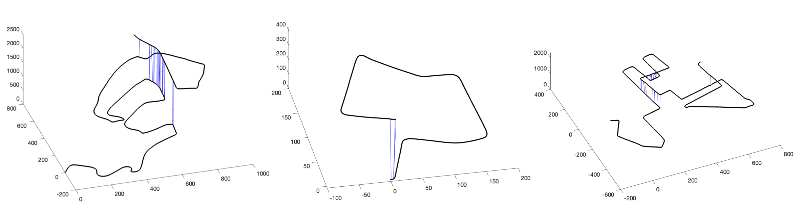
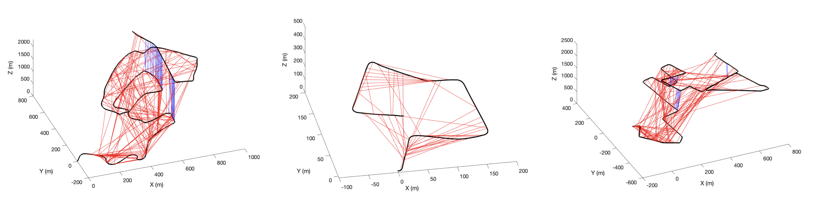
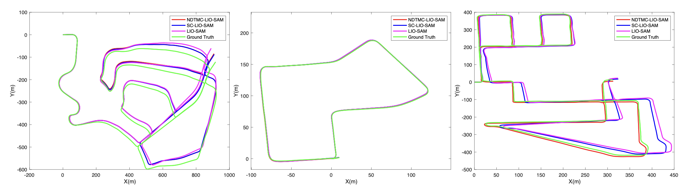
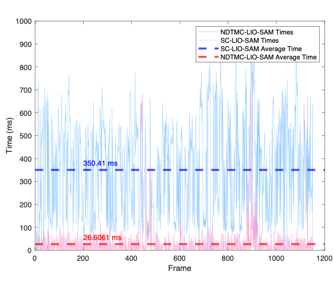

# NDTMC-LIO-SAM

**A real-time lidar-inertial SLAM package.**
- This repository is a SLAM method combined with [NDTMC](https://github.com/SlamCabbage/NDTMC) and [LIO-SAM](https://github.com/TixiaoShan/LIO-SAM), which enables Robust loop closure detection to eliminate accumulated errors.

## Example
Our method is tested on the open source dataset KITTI.

The matching results of our method on the three sequences of KITTI 02, 07 and 08 are:
<!-- <p align="center"></p> -->

<p align="center">

On the basis of the same threshold setting, the matching results of SC-LIO-SAM are:
<!-- <p align="center"></p> -->

<p align="center">

When the similarity threshold is 0.6, the trajectory comparison figure is as follows:
 
<p align="center">

and the time required by the two methods is compared:

<p align="center">


## How to use?
- You can download the [KITTI](https://drive.google.com/drive/folders/1gJHwfdHCRdjP7vuT556pv8atqrCJPbUq?usp=sharing), and then you can complete the self-test according to the following steps:

#### Place the directory `NDTMC-LIO-SAM` under user catkin work space <br>
 For example, 

    ```
    cd ~/catkin_ws
    git clone https://github.com/SlamCabbage/NDTMC-LIO-SAM.git
    cd ..
    catkin_make
    source devel/setup.bash
    ```

After compiling, you can use the script we provide to run the program,

    ```
    launch_file = 'path/to/run.launch'
    bag_files = [
        'path/to/.bag'
    ]
    cd src/NDTMC-LIO-SAM/script
    python3 autoRun.py
    rviz -d src/NDTMC-LIO-SAM/launch/include/config/rviz.rviz
    ```

## Dependency
- All dependencies are same as the original [LIO-SAM](https://github.com/TixiaoShan/LIO-SAM#dependency)
- Additional installation of ceres is required:
```
# CMake
sudo apt-get install cmake
# google-glog + gflags
sudo apt-get install libgoogle-glog-dev libgflags-dev
# Use ATLAS for BLAS & LAPACK
sudo apt-get install libatlas-base-dev
# Eigen3
sudo apt-get install libeigen3-dev
# SuiteSparse (optional)
sudo apt-get install libsuitesparse-dev
git clone https://ceres-solver.googlesource.com/ceres-solver
cd ceres-solver
git checkout -b build 1.14.0
mkdir build
cd build
cmake ..
make -j4
sudo make install
```

## Cite NDTMC-LIO-SAM 

```
@inproceedings { 
 comming soon.
}
```
 and 
```
@inproceedings{liosam2020shan,
  title={LIO-SAM: Tightly-coupled Lidar Inertial Odometry via Smoothing and Mapping},
  author={Shan, Tixiao and Englot, Brendan and Meyers, Drew and Wang, Wei and Ratti, Carlo and Rus Daniela},
  booktitle={IEEE/RSJ International Conference on Intelligent Robots and Systems (IROS)},
  pages={5135-5142},
  year={2020},
  organization={IEEE}
}
```
 and
 ```
 @inproceedings { gkim-2018-iros,
  author = {Kim, Giseop and Kim, Ayoung},
  title = { Scan Context: Egocentric Spatial Descriptor for Place Recognition within {3D} Point Cloud Map },
  booktitle = { Proceedings of the IEEE/RSJ International Conference on Intelligent Robots and Systems },
  year = { 2018 },
  month = { Oct. },
  address = { Madrid }
}
 ```

## Contact
- Maintainer: Lizhou Liao (`liaolizhou@icloud.com`)
#### Contributors
- Lizhou Liao: completed the code

## Acknowledgement
  - Thanks for SC-LIO-SAM.
  - Thanks for NIO low-speed localization and mapping group.
